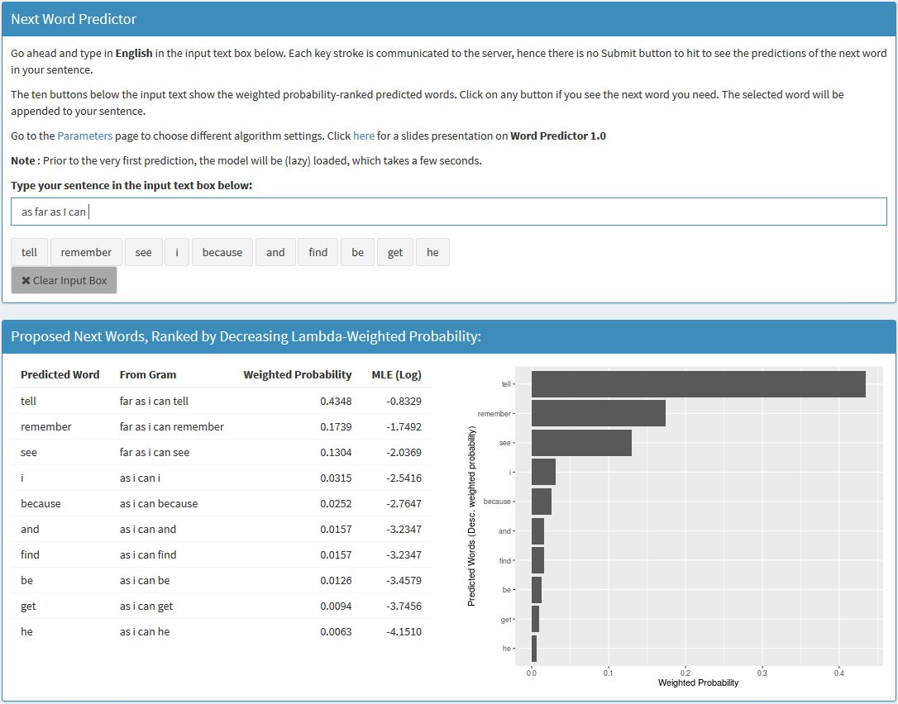

<style>
.reveal h1, .reveal h2, .reveal h3 {
  word-wrap: normal;
  -moz-hyphens: none;
}
.small-code pre code {
  font-size: 1em;
}
</style>

Next Word Predictor
========================================================
class: small-code
author: Coursera Data Science Capstone Project, Bertrand Rigaldies, October 3rd, 2016
autosize: true
font-family: 'Helvetica'
transition: rotate
width: 1440
height: 900


* An N-grams-based probabilistic [model](#/model) to predict the next most likely words in an english sentence (See example of R output below);
* Using Maximum Likelihood Estimates (MLE), and [Stupid Backoff Algorithm](#/predictor)-based prediction;
* Achieving about 55% prediction [success rate](#/performance);
* Test drive it [here](#/shinyapp).


```r
predictWithStupidBackoff2(model = model, sentence = 'as far as I can', matches_count_max = 5)
```

```
   Predicted Word             From Gram Weighted Probability  MLE (Log)
1:           tell     far as i can tell           0.43478261 -0.8329091
2:       remember far as i can remember           0.17391304 -1.7491999
3:            see      far as i can see           0.13043478 -2.0368819
4:              i            as i can i           0.03149606 -2.5416020
5:        because      as i can because           0.02519685 -2.7647455
```

1. The Probabilistic Model
========================================================
id: model
class: small-code

* English Corpus from [HC Corpora](www.corpora.heliohost.org).
* 10% of the English Corpus used as training dataset.
* 5 N-grams tables built from the training dataset, N = 1 to 5.
* Each N-gram table is structured as follows:

Column | Description
------------- | -------------
**gram** | The gram as a string of one ($N=1$) or more ($N\gt2$) words.
**count** | The number of times the gram is used in the Corpus training dataset.
**lowergram** | The preceding lower-order gram when $N\gt2$, or "lowergram" (e.g., "in the" in gram "in the world").
**last_word_in_gram** | The last word in the gram (e.g., "world" in gram "in the world").
**logprob** | Logarithm of the gram's **Maximum Likelihood Estimation** (MLE).
**logpercent** | Logarithm of the gram's **Percent Use** (PU) based on the gram's count.

**Maximum Likelihood Estimation**: $P_{MLE}(w_n \ldots w_1) = P(w_n|w_{n-1} \ldots w_1) = \frac{Count(w_n \ldots w_1)}{Count(w_{n-1} \ldots w_1)}$

**Percent Use**: $P_{PU}(w_n \ldots w_1) = \frac{Count(w_n \ldots w_1)}{Total Number of N-Grams}$

2. The Stupid Backoff Algorithm
========================================================
id: predictor

Reference: [Speech and Language Processing, Daniel Jurafsky & James H. martin, January 9, 2015, Chapter 4: N-Grams, section 4.5.1 The Web and Stupid Backoff](https://web.stanford.edu/~jurafsky/slp3/4.pdf)

The basic flow is:

1. Lookup the top 10 matches in the highest order N-gram table in the model, where lowergram = last (N-1) words in the input sentence;
1. If less than 10 matches were found, **back off** and look up for additional matches in the (N-1)-gram table;
1. At each backoff, *discount* the matches' MLE probabilities by applying a $\lambda$ weight. (e.g., $\lambda=0.4$): $P_{MLE(weighted)}(w_{1} \ldots w_{N-1}w_{match}) = \lambda^{(4 - (N-1))} * P_{MLE}(w_{1} \ldots w_{N-1}w_{match})$
1. Repeat the previous step until 10 matches are found, using the unigrams table as the last lookup step.
1. Return the top 10 matches (or predictions), sorted by $\lambda\$-weighted MLE.

3. Quantitative Predictive Performance: ~55%
========================================================
id: performance
class: small-code

* Sample 10% of the non-training data in the English Corpus to create a test dataset;
* Build a bi, tri, quad, and pentagrams from the test dataset;
* For each N-gram, build a `data.table` with the following columns: a) `gram`: The gram; b) `lowergram`: The gram's immediate lower-order gram; c) `word_to_predict`: the gram's last word
* Sample 25,000 grams from each N-gram (N=2 to 5), and `rbind` the resulting samples into a 100,000-row table:

```
                    gram   lowergram word_to_predict
1:        are we to make   are we to            make
2: make better decisions make better       decisions
3:          its too much     its too            much
```
* **Success Criteria**: For each `gram` in the test `data.table`, run the Stupid Backoff prediction on the `lowergram`, and if the resulting 10 predictions contain the gram's `word_to_predict`, then the test is a PASS, else the test is a FAIL.

```r
set.seed(10); testSample = sample_n(testData, 1)
print(testSample)
```

```
             gram lowergram word_to_predict
1: are we to make are we to            make
```

```r
predictWithStupidBackoff2(model = model, sentence = testSample$lowergram)
```

```
    Predicted Word      From Gram Weighted Probability MLE (Log)
 1:           make are we to make         0.0615384615 -1.871802
 2:           play are we to play         0.0615384615 -1.871802
 3:             do       we to do         0.0177777778 -2.197225
 4:            the         to the         0.0050152354 -2.546403
 5:             be          to be         0.0037864492 -2.827454
 6:            get         to get         0.0016445112 -3.661440
 7:              a           to a         0.0012895389 -3.904598
 8:            see         to see         0.0012541580 -3.932419
 9:             go          to go         0.0009725078 -4.186760
10:           have        to have         0.0009164106 -4.246174
```

4. My Shinyapps.io Application
========================================================
id: shinyapp



Connect to my application [here](https://brigaldies.shinyapps.io/NextWordPredictor/).

For me only - Grading Criteria
========================================================
* Does the link lead to a 5 slide deck on R Pubs?
* Does the slide deck contain a description of the algorithm used to make the prediction?
* Does the slide deck describe the app, give instructions, and describe how it functions?
* How would you describe the experience of using this app?
* Does the app present a novel approach and/or is particularly well done?
* Would you hire this person for your own data science startup company?
