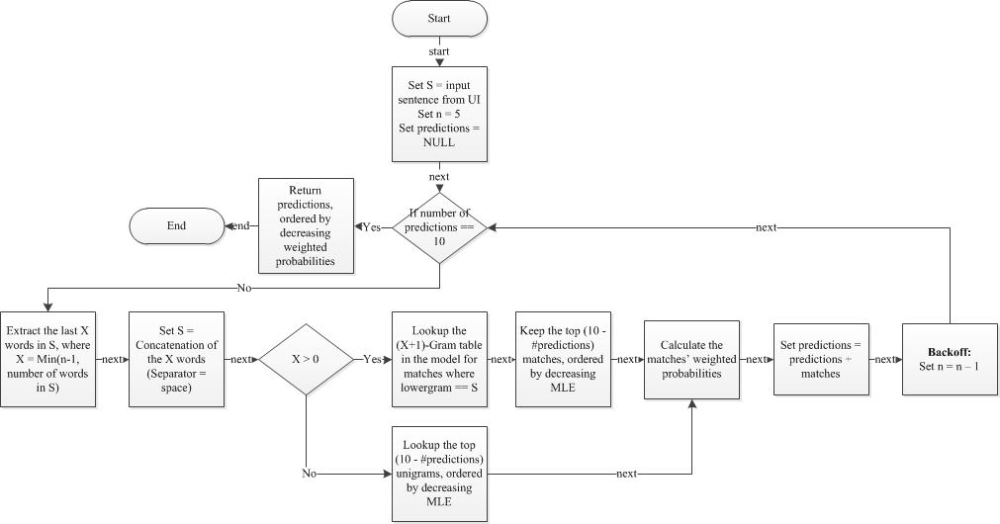

<style>
.reveal h1, .reveal h2, .reveal h3 {
  word-wrap: normal;
  -moz-hyphens: none;
}
.small-code pre code {
  font-size: 1em;
}
</style>

Next Word Predictor
========================================================
class: small-code
author: Coursera Data Science Capstone Project, Bertrand Rigaldies, October 3rd, 2016
autosize: true
font-family: 'Helvetica'
transition: rotate
width: 1440
height: 900


* An N-grams-based probabilistic [model](#/model) to predict the next most likely words in an english sentence (See example of R output below)
* Using Maximum Likelihood Estimates (MLE), and [Stupid Backoff Algorithm](#/predictor)-based weighted probabilities;
* Achieving about 25% prediction [success rate](#/performance);
* Test drive it [here](#/shinyapp).


```r
predictWithStupidBackoff2(model = model, sentence = 'as far as I can', matches_count_max = 5)
```

```
   Predicted Word             From Gram Weighted Probability  MLE (Log)
1:           tell     far as i can tell           0.43478261 -0.8329091
2:       remember far as i can remember           0.17391304 -1.7491999
3:            see      far as i can see           0.13043478 -2.0368819
4:              i            as i can i           0.03149606 -2.5416020
5:        because      as i can because           0.02519685 -2.7647455
```

1. The Predictive Model
========================================================
id: model

* English Corpus f
* Training dataset
* N-grams

$P_{PU}(w_n \ldots w_1) = \frac{Count(w_n \ldots w_1)}{Total Number of N-Grams}$

$P_{MLE}(w_n \ldots w_1) = P(w_n|w_{n-1} \ldots w_1) = \frac{Count(w_n \ldots w_1)}{Count(w_{n-1} \ldots w_1)}$


2. The Stupid Backoff Algorithm
========================================================
id: predictor



3. Quantitative Predictive Performance
========================================================
id: performance

* Test dataset
* Test
* Result

4. My Shinyapps.io Application
========================================================
id: shinyapp


Connect to my application [here](https://brigaldies.shinyapps.io/NextWordPredictor/).

For me only - Grading Criteria
========================================================
* Does the link lead to a 5 slide deck on R Pubs?
* Does the slide deck contain a description of the algorithm used to make the prediction?
* Does the slide deck describe the app, give instructions, and describe how it functions?
* How would you describe the experience of using this app?
* Does the app present a novel approach and/or is particularly well done?
* Would you hire this person for your own data science startup company?
